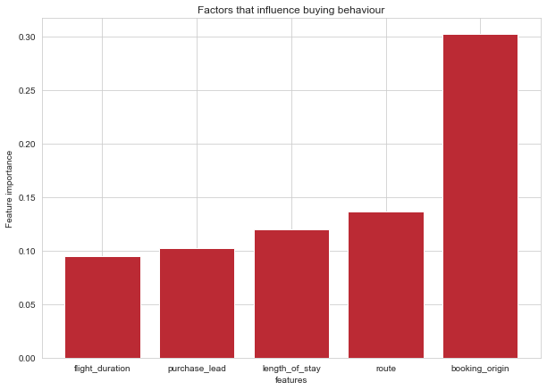
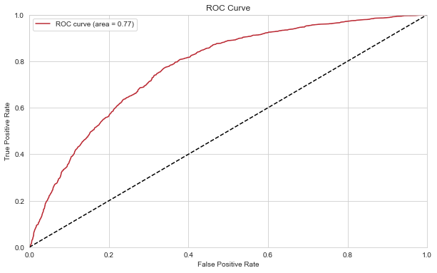

# Customer Feedback Analysis
 

### Evaluation

• The most important variable in the model was
purchase_lead, that is the time between purchase and
departure.
• Information about the flight, e.g. flight time and
duration was also significant, however booking origin of
the customer was not important.
• The accuracy of the model was approximately 0.7
(Precision) and 0.003 (Recall), showing that this model
requires more improvement. I suggest adding more
customer-centric features into the model.

#### Feature Importances

#### ROC

